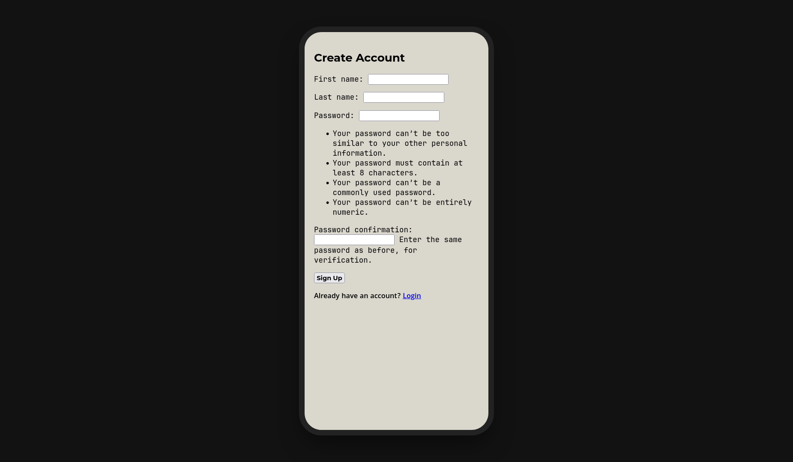
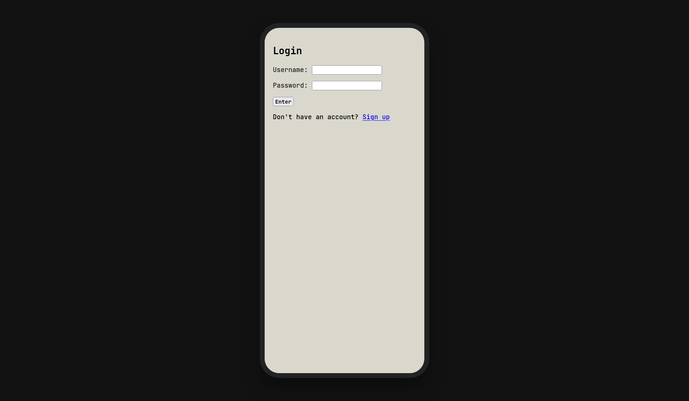
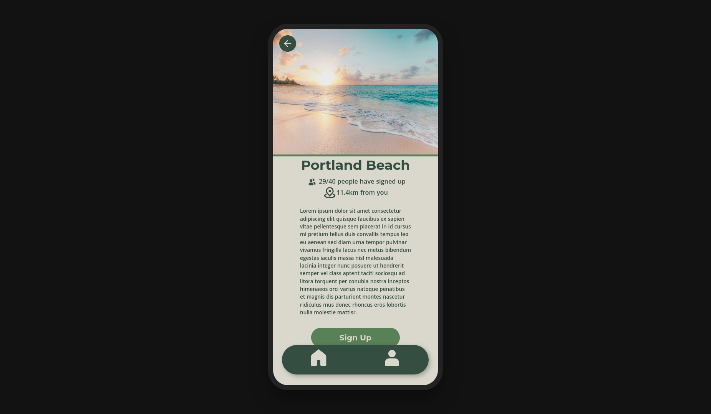
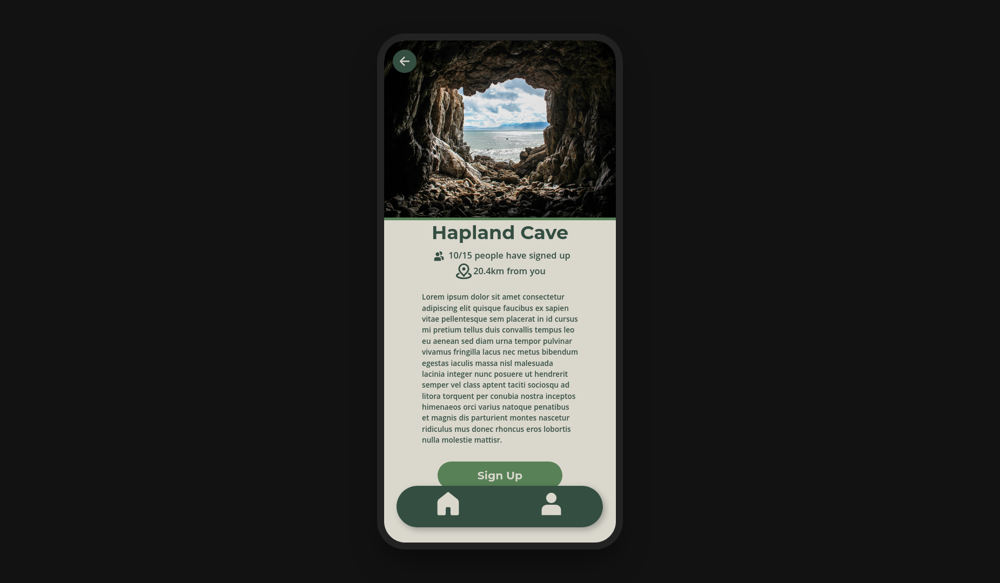
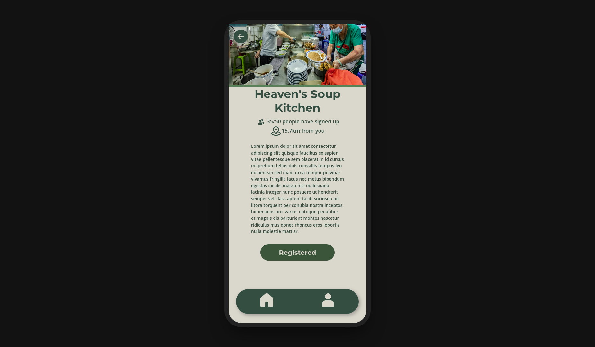

# Volunteering App

A prototype of an app written in Django that allows you to sign up for charity opportunities. Or, rather, a website that looks like a mobile app. I didn't have the time to make a real mobile app, sadly...

This is my first Django project, so please be nice...

## Features

- Login/Registration functionality
- The ability to sign up for volunteering opportunities
- 'Weekly streak' functionality (not really, tbh... you can only change your weekly streak by going into the admin panel yourself)

## Usage

Run the following to start all services:

```sh
git clone https://github.com/dastarruer/volunteering-app
docker compose up -d
```

Then, go to http://localhost:8000 in your browser of choice.

To get access to the admin panel (where you can add your own opportunities, play around with users, etc.), run the following to create a superuser:

```sh
docker compose exec web python manage.py createsuperuser
```

Then, go to http://localhost:8000/admin in your browser of choice. Sign in with the same details that you used to create the superuser.

## Images

### Register/Login Screens




### Homepage Screen


### Opportunity Screens






### Profile Screens


